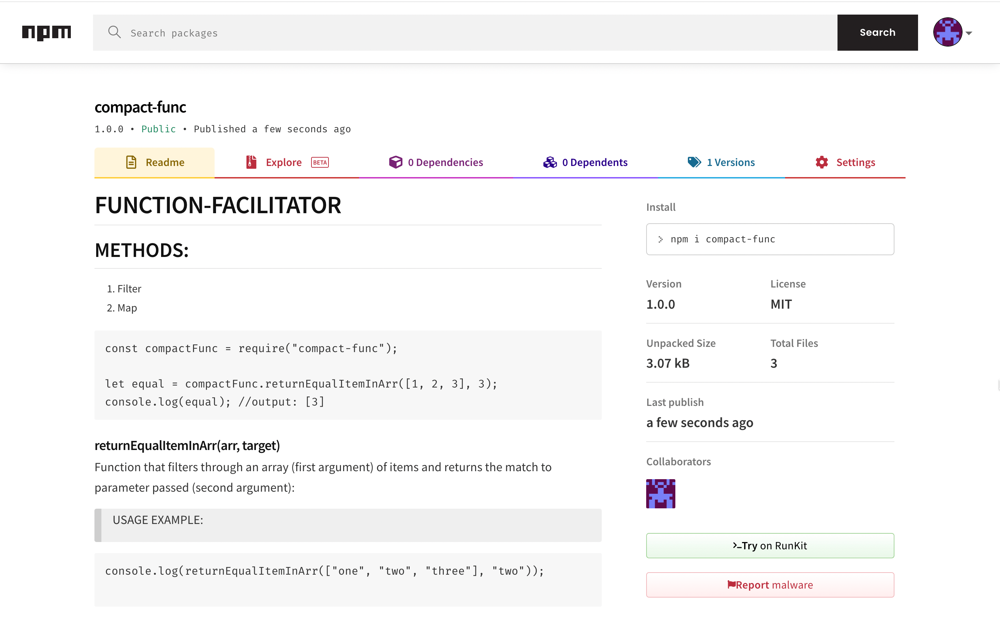

# FUNCTION-FACILITATOR



[Check it out on NPM website](https://www.npmjs.com/package/compact-func)

## METHODS:

1. Filter
2. Map

```
const compactFunc = require("compact-func");

let equal = compactFunc.returnEqualItemInArr([1, 2, 3], 3);
console.log(equal); //output: [3]
```

### returnEqualItemInArr(arr, target)

Function that filters through an array (first argument) of items and returns the match to parameter passed (second argument):

> USAGE EXAMPLE:

```
console.log(returnEqualItemInArr(["one", "two", "three"], "two"));

```

- Output: [ 'two' ]

### returnNotEqualItemInArr(arr, target)

Function that filters through an array (first argument) of items and returns all BUT the match to parameter passed (second argument):

> USAGE EXAMPLE:

```
console.log(returnNotEqualItemInArr(["one", "two", "three"], "two"));
```

- Output: [ 'one', 'three' ]

### returnObjEqualInArr(arr, par, target)

Function that filters through an array of objects (first argument) and returns the match to target parameter passed (Third argument). The second argument is the 'key' property of the object:

> USAGE EXAMPLE:

```
console.log(
  returnObjEqualInArr(
    [{ name: "one" }, { name: "two" }, { name: "three" }],
    "name",
    "two"
  )
);
```

- Output: [ { name: 'two' } ]

### returnObjNotEqualInArr(arr, par, target)

Function that filters through an array of objects (first argument) and returns all BUT the match to target parameter passed (Third argument). The second argument is the 'key' property of the object:

> USAGE EXAMPLE:

```
console.log(
  returnObjNotEqualInArr(
    [{ name: "one" }, { name: "two" }, { name: "three" }],
    "name",
    "two"
  )
);
```

- Output: [ { name: 'one' }, { name: 'three' } ]

### copyOriginalArrAndDoThisToEach(arr, doFunc)

Function that Maps through an array (first argument) and returns a copy of the original array after running the function passed (second argument).

> USAGE EXAMPLE:

```
console.log(copyOriginalArrAndDoThisToEach([1, 2, 3], (item) => item * 2));
```

- Output: [ 2, 4, 6 ]
